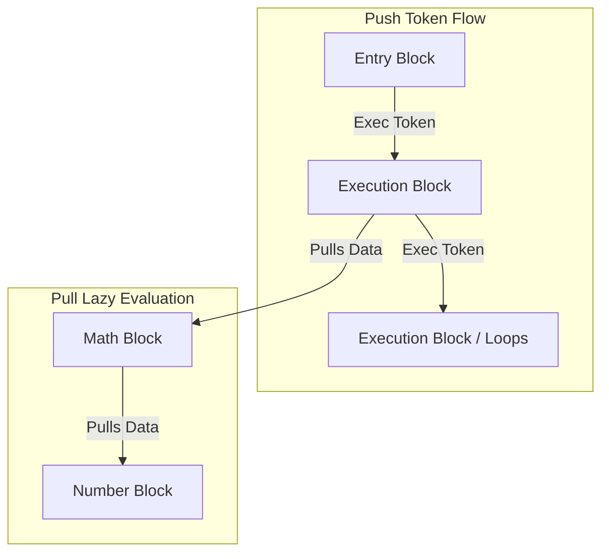

# ComfyLAB — Visual Lab Automation Environment

[](https://gateeit-ifgw.github.io/ComfyLAB/)
[](https://pypi.org/project/comfylab/)
[](https://pypi.org/project/comfylab/)
[](LICENSE)

🌐 **Official Website & Interactive Showcase:** [https://gateeit-ifgw.github.io/ComfyLAB/](https://gateeit-ifgw.github.io/ComfyLAB/)

ComfyLAB (**Comf**ortable **L**ab **A**utomation **B**locks) is a visual, block-based software platform for automating scientific and test & measurement laboratory experiments. It allows researchers, students, and engineers to connect instruments, run analysis code, and view live plots using an intuitive drag-and-drop workspace.

> Developed and maintained by the **Electronics and Instrumentation team** from the **"Gleb Wataghin" Physics Institute (IFGW)** at the **University of Campinas (UNICAMP)**.


---

## ✨ Features

- **Visual Block Programming**: Design automation procedures by connecting blocks together. No complex programming required.
- **Rich Block Library**: Extensive set of built-in blocks covering math, curve fitting, signal processing, array manipulation, control flow, file I/O, live plotting, instrument drivers, and utility functions.
- **Run Scripts in 13+ Languages & Native DLLs**: Run code blocks written in Python, Rust, C#, Julia, R, JavaScript, TypeScript, Lua, Octave, Maxima, Sage, Wolfram, or PowerShell, and bridge compiled C/C++ DLLs/.so or Windows ActiveX/COM controllers directly in your pipeline.
- **Equipment Control**: Connect and control physical laboratory hardware via VISA/SCPI protocol and dedicated instrument drivers.
- **Built-in Laboratory Safety**: If an automation run fails, is stopped, or encounters an error, ComfyLAB automatically triggers safety shutdown routines on instruments (e.g. turning off lasers or signal generator outputs) to protect your hardware.
- **Real-Time Live & Multi-Trace Graphs**: Stream data in real time with single and multi-trace live plotting widgets, custom axis limits, and persistent settings.
- **Whiteboard Canvas Overlay**: Draw diagrams, write notes, and add shapes directly on top of your workspace.
- **Custom Cluster Blocks**: Group a set of connected blocks into a single custom cluster block to keep your workspace clean and organized.
- **Security Protections**: Prevents untrusted blueprints from executing malicious scripts on your computer. You will be warned and asked for approval before running code from unknown sources.
- **Secure Remote Access**: Remotely access your lab setup PC running ComfyLAB, protected by a simple two-word token (user/password also available if needed).
- **ComfyLAB Official Store & Modular Ecosystem**: Decoupled instrument driver, cluster, and blueprint store. Install support for specific laboratory hardware with 1 click, subscribe to makers (Keysight, Tektronix, Thorlabs, etc.) with automated sync, and let dependencies auto-resolve.
- **Application Info & About Modal**: Access application details, license info, and versioning directly from the UI toolbar.

---

## 🚀 Getting Started

You can install and run ComfyLAB in multiple ways:

### Option 1: Install from PyPI (Quickest & Recommended)

Install ComfyLAB directly from PyPI via `pip`:

```bash
pip install comfylab
```

Then start the application from anywhere:

```bash
comfylab
```
*(or run via `python -m comfylab`)*

ComfyLAB will launch the backend server and automatically open the application in your default web browser.

---

### Option 2: Pre-compiled Releases (Run-Ready)

#### A. Standalone Windows Executable (Zero-Dependency)
1. Download `comfylab-executable-vX.X.X-windows-x86_64.zip` from the **GitHub Releases** page and extract it.
2. Launch the application:
   * Double-click `ComfyLAB.exe`.
3. Automatically opens in your default browser at `http://localhost:8000` (no Python or admin rights required).

#### B. Base Release Package (Cross-Platform ZIP Archive)
Recommended for Linux and macOS, or Windows users who prefer a lightweight portable folder:
1. Download the release `.zip` package (`comfylab-release-vX.X.X.zip`, ~2 MB) from the **GitHub Releases** page and extract it.
2. Launch the application:
   * **Linux / macOS**: Run `bash start.sh` in a terminal.
   * **Windows**: Double-click `start.bat`.
3. The bootstrapper script automatically initializes a local virtual environment, verifies dependencies, starts the backend, and opens your browser.

---

### Option 3: Running from Source (Developer Mode)
If you cloned the source code from GitHub:

1. Ensure you have **Python 3.10+** and **Node.js (npm)** installed.
2. Run the bootstrapper:
   * **Linux / macOS**: `bash start.sh`
   * **Windows**: Run `start.bat` in Command Prompt.
3. The bootstrapper will:
   * Initialize the local `.venv` environment and install Python requirements.
   * Run `npm install` inside `frontend/` if needed.
   * Launch the FastAPI backend (port `8000`) and the Vite dev server (port `5173`) concurrently with hot-reloading at `http://localhost:5173`.

---

### 🎛️ Command Line Options

You can customize the startup configuration with command-line flags (supported across `comfylab`, `python -m comfylab`, `start.sh`, and `start.bat`):

| Argument | Default | Description |
| :--- | :--- | :--- |
| `--host <ip>` | `0.0.0.0` | Binding address for the server (use `0.0.0.0` for lab network access). |
| `--port <int>` | `8000` | Port for the FastAPI backend (and web UI in production mode). |
| `--local` | *(disabled)* | Restrict server access to localhost only (`127.0.0.1`). |
| `--lite` | *(disabled)* | Launch in Lite Mode (reduces visual effects/animations for lower-power hardware). |
| `--dev` | *(disabled)* | Force Development Mode (runs Vite dev server and FastAPI concurrently with hot-reload). |
| `--vite-port <int>` | `5173` | Port for the Vite dev server (development mode only). |

**Examples:**
```bash
# Run locally with lite visual mode on custom port
comfylab --local --port 8080 --lite

# Run via python module runner
python -m comfylab --host 0.0.0.0 --port 9000
```

---

## 🧩 Block Categories & Capabilities

ComfyLAB provides a rich, modular ecosystem of blocks for building automation workflows:

- **Math & Curve Fitting**: Basic arithmetic, trigonometric & logarithmic functions, polynomial, exponential, gaussian, and custom non-linear curve fitting.
- **Logic & Control Flow**: Boolean operations (AND, OR, NOT, XOR), comparisons, execution branches (If/Else), For/While loops, and sequential execution blocks.
- **Data Structures & Arrays**: Lists, Dictionaries, and multi-dimensional NDArrays (reshaping, slicing, linear algebra, statistics, and array-to-image conversion).
- **Signal Processing**: FFT & power spectral analysis, bandpass/lowpass/highpass filtering, detrending, windowing, and peak finding algorithms.
- **File I/O & Storage**: Read and write CSV files, JSON data, Parquet, and raw text files with automatic path resolution.
- **Visualization**: Interactive single and multi-trace line plots, scatter plots, and heatmaps/image viewers.
- **Instruments & VISA**: Direct VISA SCPI command/query execution and built-in drivers for oscilloscopes, signal generators, DMMs, optical spectrum analyzers, and power supplies.
- **Multi-Language Scripting**: Polyglot code execution blocks supporting 9 scripting languages (Python, Rust, JavaScript, TypeScript, Julia, R, Lua, Octave, Wolfram).
- **Clusters**: Group complex sub-graphs into custom reusable cluster blocks with dynamic input/output boundaries.
- **Utility & Timing**: Delays, timestamps, stopwatches, type conversion, console logging, and debugging inspectors.

---

## 🛍️ ComfyLAB Store & Modular Equipment Ecosystem

To keep the core distribution ultra-lightweight, portable, and fast to boot, physical vendor hardware drivers, advanced sub-canvas clusters, and complete experiment blueprints are decoupled from the core and distributed modularly through the **Official ComfyLAB Store** ([gateeit-ifgw/comfylab-store](https://github.com/gateeit-ifgw/comfylab-store)).

* **Single-Click Installation**: Access the Store directly from the top navigation bar (`[ 🛍️ Store ]`) or the application menu. Browse by category (**Instruments**, **Clusters**, **Blueprints**, **Blocks**) or search by vendor and instrument model.
* **Topological Dependency Resolution**: Installing a high-level experiment blueprint or cluster automatically resolves, downloads, and registers all required dependencies (such as underlying instrument drivers and sub-clusters) in the correct topological order.
* **Automatic Missing Block Detection**: If you open a blueprint referencing hardware drivers or clusters not yet installed locally, ComfyLAB highlights them and provides a one-click button to download the exact required packages from the Store.
* **Vendor & Category Subscriptions**: Subscribe to *All Instruments* or individual manufacturers (e.g. Keysight, Tektronix, Agilent, Minipa, Thorlabs, Keithley, CAEN). ComfyLAB checks for new packages and updates on startup or whenever you click "Sync Now".
* **Cryptographic Security & Verification**: Every store package and the central catalog are digitally signed with Ed25519 cryptography and SHA-256 integrity hashes to ensure all downloaded drivers are authentic and untampered.

---

## 📸 Example Workflows

| Experiment Automation Pipeline | Interactive Data Analysis & Plotting |
| :--- | :--- |
|  |  |

---

## 🏗️ Technical Architecture

The execution engine uses a **Hybrid State Machine (Push/Pull)** model inspired by game engine blueprints (such as Unreal Engine Blueprints), allowing cycles/loops and branches while retaining lazy evaluation of math/logic pipelines.



### 1. Push Wires (Execution Token)
* Defined by connections of type `exec` between `ExecOut` and `ExecIn` pins.
* Wires push an "Execution Token" forward, specifying state changes and the sequential execution order.
* Execution path loops (cycles) are natively supported for operations like `ForLoop`.

### 2. Pull Wires (Lazy Evaluation Data Bus)
* Defined by connections of type `data` between `DataOut` and `DataIn` pins.
* Calculated **on demand (lazy evaluation)** when an execution block pulls data.
* Calculation results are cached *within a single execution step* to prevent redundant recalculation. Caching is cleared between execution steps.

### 3. VISA Concurrency (ResourceLockManager)
* Automating hardware requires calling blocking VISA APIs. 
* To prevent conflicts when multiple blocks access the same physical hardware concurrently, the `ResourceLockManager` manages async locks mapping `VISA address -> asyncio.Lock`.
* Safely resolves resource contentions with timeout/watchdog support to prevent deadlocks.

---

## 📂 Project Structure

```
ComfyLAB/  (root)
├── pyproject.toml              # Modern PEP 517/518 packaging configuration (PyPI)
├── MANIFEST.in                 # Source distribution inclusion/exclusion rules
├── LICENSE                     # Software license (GPLv3)
├── README.md                   # This document
├── requirements.txt            # Python package dependencies
├── VERSION                     # Application version tracking
├── start.sh                    # Linux/macOS venv bootstrapper
├── start.bat                   # Windows venv bootstrapper
├── start.py                    # Cross-platform startup launcher (delegates to comfylab.cli)
├── pyinstaller_entry.py        # PyInstaller application entry point
├── build_exe.py                # Builds the standalone single-file executable
├── build_release.py            # Builds the release ZIP and PyPI wheel packages
├── ComfyLAB.spec               # PyInstaller spec (frozen core + external blocks)
├── backend/                    # FastAPI API routers & WebSockets server
│   └── routers/store.py        # Store API, package download, dependency resolution & subscriptions
├── comfylab/                   # Core Python Package & Execution Engine
│   ├── __main__.py             # Entry point for `python -m comfylab`
│   ├── cli.py                  # Unified CLI coordinator & argument handler
│   ├── engine/                 # Models, executor, lock manager, registry, security, config
│   ├── blocks/                 # Block protocol (base), category modules, scripts, VISA, Store loader
│   ├── clusters/               # Built-in generic & virtual cluster definitions
│   ├── devices/                # Extensible base & virtual instrument driver modules
│   └── examples/               # Built-in generic example experiment workflows (.json)
├── frontend/                   # React + Vite + React Flow web UI (includes Store modal)
├── dist/comfylab-store/        # Official Store repository (packages, catalog, CI actions)
└── tests/                      # Automated pytest integration & unit tests
```

---

## 📦 Building Releases (For Developers)

ComfyLAB provides automated build scripts in the root directory to generate production distribution packages.

### 1. Build Portable ZIP Release Package
To compile the frontend and package a ready-to-run release `.zip`:
```bash
python3 build_release.py
# Optionally bump version before building:
python3 build_release.py --bump [patch|minor|major]
```

### 2. Build Standalone Windows Executable
To compile the standalone Windows executable (`ComfyLAB.exe`) from Linux/macOS using Docker and Wine:
```bash
./build_windows_docker.sh
```
Or directly on a native Windows machine:
```cmd
python build_exe.py
```

---

## 🧪 Running the Verification Suite
To execute all unit and integration tests:
```bash
python3 -m pytest tests/
```

---

## 🏛️ Development & Maintenance

ComfyLAB is developed and maintained by the **Electronics and Instrumentation team** from the **"Gleb Wataghin" Physics Institute (IFGW)** at the **University of Campinas (UNICAMP)**, Brazil.

---

## 📄 License

This project is licensed under the **GNU General Public License v3.0** - see the [LICENSE](LICENSE) file for details.

---

## 🤖 AI Assistance Disclosure

Portions of this codebase were developed with the assistance of AI coding tools. All design decisions, architecture, domain-specific logic, and final implementation choices were authored and reviewed by the project maintainer. AI tools were used as a productivity aid, in the same spirit as an IDE, a linter, or a documentation reference.

